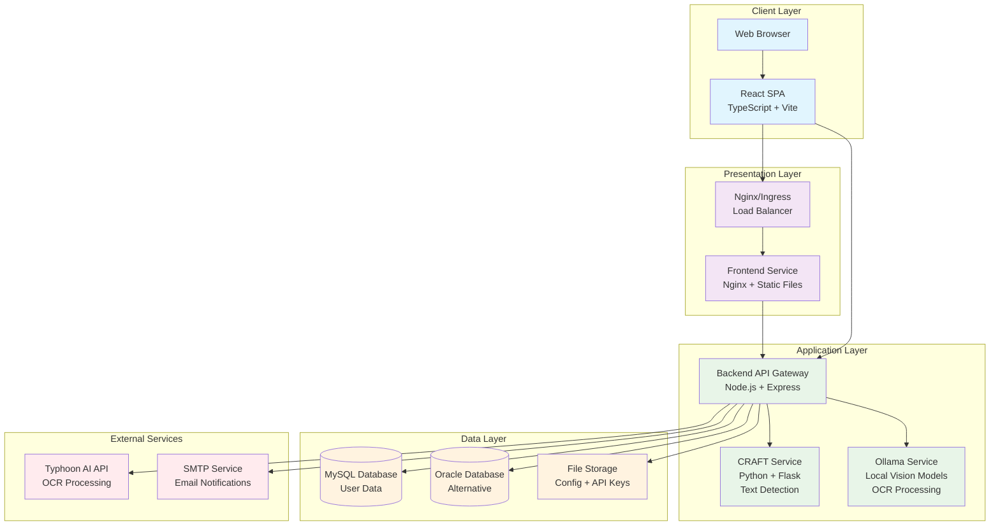

# OCR SplitView Technical Specification

## Version
1.0.0 - Baseline Edition

## Document Information
- **Created**: 2026-01-05
- **Purpose**: Comprehensive technical specification for OCR SplitView project
- **Status**: Baseline for future editions

---

## 1. System Overview

OCR SplitView is a web-based Optical Character Recognition (OCR) application that provides users with an intuitive interface to extract text from images. The system consists of a React-based single-page application (SPA) frontend and a Node.js/Express backend that serves as an API gateway to external OCR services.

### 1.1 Key Features
- **OCR Processing**: Real-time text extraction from uploaded images using Typhoon AI API or Ollama with local vision models
- **User Management**: Registration, authentication, and role-based access control
- **API Key Management**: User-specific API keys with usage limits and expiration
- **Processing History**: Local storage of OCR results with image previews
- **Batch Processing**: Support for processing multiple images simultaneously
- **Admin Dashboard**: User management and system configuration
- **Hybrid Storage**: Combination of local storage and server-side databases
- **Containerized Deployment**: Docker and Kubernetes support for scalable deployment
- **Searchable PDF Generation**: Create PDFs with embedded text from OCR results
- **Multi-language Support**: Thai and English text recognition
- **Engine Selection**: Configurable OCR engine (Typhoon or Ollama) with per-request override

### 1.2 Technology Stack

#### Frontend
- **Framework**: React 19.2.0 with TypeScript
- **Build Tool**: Vite 6.2.0
- **Styling**: Tailwind CSS with industrial theme
- **Icons**: Lucide React
- **State Management**: React hooks and context
- **HTTP Client**: Native Fetch API
- **OCR Client**: Tesseract.js for client-side processing
- **PDF Generation**: pdf-lib with fontkit

#### Backend
- **Runtime**: Node.js with Express 5.1.0
- **Database**: MySQL 2.3.15.3 / OracleDB 6.10.0
- **File Upload**: Multer 1.4.5
- **Email**: Nodemailer 7.0.11
- **HTTP Client**: Axios 1.7.9
- **Environment**: dotenv 16.4.7

#### Infrastructure
- **Containerization**: Docker
- **Orchestration**: Kubernetes
- **Ingress**: Nginx Ingress Controller
- **Storage**: Persistent Volumes
- **Configuration**: ConfigMaps and Secrets

#### External Services
- **OCR Engine**: Typhoon AI API (https://api.opentyphoon.ai/v1) or Ollama (local vision models)
- **Text Detection**: CRAFT service for text region detection
- **Email Service**: SMTP (Gmail/MailDev configurable)

---

## 2. Architecture Diagram



### 2.1 Architecture Flow
1. **User Interaction**: Users interact with the React SPA in their web browser
2. **Frontend Service**: Serves static React application files via Nginx
3. **Backend API Gateway**: Handles authentication, API key validation, and routes OCR requests to selected engine
4. **Text Detection**: Optional CRAFT service for advanced text region detection
5. **OCR Processing**: Typhoon AI API or Ollama service processes the actual OCR extraction based on configuration or request parameters
6. **Database Layer**: Stores user data, API keys, and configuration
7. **File Storage**: Persistent storage for configuration files and API keys

---

## 3. Component Descriptions

### 3.1 Frontend Components

#### Core Components
- **App.tsx**: Main application component managing state, routing, and overall application flow
- **LoginPage.tsx**: User authentication interface with email/password login
- **RegisterPage.tsx**: User registration form with validation
- **UploadArea.tsx**: Drag-and-drop file upload interface supporting multiple image formats
- **ImageViewer.tsx**: Image display and preview component with zoom capabilities
- **JsonViewer.tsx**: JSON output display with syntax highlighting and formatting
- **HistorySidebar.tsx**: Processing history management with search and restore functionality
- **SettingsPage.tsx**: User settings and API key management interface
- **AdminDashboard.tsx**: Administrative user and system management interface

#### Component Hierarchy
```
App
├── Authentication (LoginPage/RegisterPage)
├── Header (Navigation & Status)
├── Main Content Area
│   ├── JsonViewer (OCR Results)
│   └── ImageViewer/UploadArea (Image Processing)
├── HistorySidebar (Modal)
├── SettingsPage (Modal)
├── AdminDashboard (Modal)
└── Footer (Actions & Status)
```

### 3.2 Backend Services

#### API Gateway (server.js)
The backend serves as an API gateway with the following responsibilities:
- **Authentication & Authorization**: User login/logout, session management, JWT handling
- **API Key Management**: Generation, validation, usage tracking, and expiration management
- **OCR Proxy**: Secure proxy to Typhoon OCR API with request/response transformation
- **User Management**: CRUD operations for user accounts and role management
- **Configuration Management**: Dynamic system configuration via file-based storage
- **Database Abstraction**: Support for both MySQL and Oracle databases
- **Email Services**: Password reset and notification emails
- **File Processing**: Image upload handling and validation

#### Service Layer (Frontend)
- **authService.ts**: Authentication state management and API communication
- **ocrService.ts**: OCR processing orchestration and API communication
- **historyService.ts**: Local storage management for processing history
- **apiKeyService.ts**: API key retrieval and management

#### CRAFT Service (services/craft/)
- **app.py**: Flask application for text region detection
- **requirements.txt**: Python dependencies for CRAFT implementation
- **Dockerfile**: Containerization for the CRAFT service

#### Ollama Service (services/ollama/)
- **Dockerfile**: Containerization for Ollama with vision models
- **Purpose**: Local OCR processing using vision-capable language models

### 3.3 External Integrations
- **Typhoon AI API**: Cloud-based OCR processing engine
- **Ollama**: Local vision model service for OCR processing
- **CRAFT Algorithm**: Text detection for enhanced PDF generation
- **SMTP Services**: Email delivery for notifications and password reset

---

## 4. API Endpoints

### 4.1 Authentication Endpoints
- `POST /api/login` - User authentication
  - **Request**: `{ email: string, password: string }`
  - **Response**: User object or error
- `POST /api/register` - User registration
  - **Request**: `{ email: string, password: string, name: string }`
  - **Response**: Success message or error
- `POST /api/forgot-password` - Password reset request
  - **Request**: `{ email: string }`
  - **Response**: Success message
- `POST /api/reset-password` - Password reset confirmation
  - **Request**: `{ email: string, token: string, newPassword: string }`
  - **Response**: Success message

### 4.2 OCR Processing Endpoints
- `POST /v1/ocr` - OCR processing (public)
  - **Request**: FormData with image file, optional `engine` parameter ("typhoon" or "ollama")
  - **Response**: OCR results from selected engine (Typhoon or Ollama)
- `POST /api/ocr_v1` - OCR processing (developer API key required)
  - **Request**: FormData with image file + Bearer token, optional `engine` parameter
  - **Response**: OCR results from selected engine
- `POST /v1/gen_pdf` - Generate searchable PDF
  - **Request**: `{ text: string, filename?: string }`
  - **Response**: PDF file download
- `POST /api/searchable_pdf` - Generate searchable PDF (developer API key required)
  - **Request**: `{ text: string, filename?: string }` + Bearer token
  - **Response**: PDF file download

### 4.3 Configuration Endpoints
- `GET /api/config` - Get system configuration
  - **Response**: Current system configuration
- `POST /api/config` - Update system configuration
  - **Request**: Configuration object
  - **Response**: Updated configuration
- `DELETE /api/config` - Reset to factory settings
  - **Response**: Success message

### 4.4 API Key Management Endpoints
- `GET /api/keys` - Get all API keys (admin)
  - **Response**: Array of API key objects
- `GET /api/keys/user/:userId` - Get user API keys
  - **Response**: User API key or null
- `POST /api/keys/request` - Request new API key
  - **Request**: `{ userId: string }`
  - **Response**: New API key object
- `PUT /api/keys/:id/status` - Update API key status
  - **Request**: `{ status: string, expiresAt?: string, usageLimit?: number }`
  - **Response**: Success message
- `DELETE /api/keys/:id` - Delete API key
  - **Request**: API key ID
  - **Response**: Success message

### 4.5 User Management Endpoints (Admin Only)
- `GET /api/users` - Get all users
  - **Response**: Array of user objects
- `PUT /api/users/:id/status` - Update user status
  - **Request**: `{ status: string }`
  - **Response**: Success message
- `PUT /api/users/:id/password` - Reset user password
  - **Request**: `{ password: string }`
  - **Response**: Success message
- `DELETE /api/users/:id` - Delete user
  - **Request**: User ID
  - **Response**: Success message

### 4.6 Utility Endpoints
- `POST /api/test-db-connection` - Test database connection
  - **Request**: Database configuration
  - **Response**: Connection status

---

## 5. Data Models

### 5.1 Core Interfaces

#### OcrResult
```typescript
interface OcrResult {
  status: 'success' | 'pending' | 'error' | 'idle';
  timestamp: string;
  extracted_text: string | null;
  confidence?: number;
  error?: string;
  filename?: string;
}
```

#### ProcessingState
```typescript
interface ProcessingState {
  status: 'idle' | 'loading' | 'success' | 'error';
  progress: number;
  message: string;
}
```

#### User
```typescript
type UserRole = 'admin' | 'user';
type UserStatus = 'active' | 'pending' | 'rejected';

interface User {
  id: string;
  email: string;
  name: string;
  role: UserRole;
  status: UserStatus;
  createdAt: string;
}
```

#### ApiKey
```typescript
type ApiKeyStatus = 'active' | 'pending' | 'revoked';

interface ApiKey {
  id: string;
  userId: string;
  key: string;
  status: ApiKeyStatus;
  createdAt: string;
  expiresAt?: string | null;
  usageLimit?: number | null;
  usageCount?: number;
}
```

#### OcrHistoryItem
```typescript
interface OcrHistoryItem {
  id: string;
  userId: string;
  fileName: string;
  timestamp: string;
  result: OcrResult | OcrResult[];
  modelUsed: string;
  imageBase64?: string;
}
```

#### SystemConfig
```typescript
interface SystemConfig {
  autoApproveApiKeys: boolean;
  allowSignup?: boolean;
  dbProvider?: 'mysql' | 'oracle';
  mysqlHost?: string;
  mysqlPort?: number;
  mysqlUser?: string;
  mysqlPassword?: string;
  mysqlDatabase?: string;
  oracleHost?: string;
  oraclePort?: number;
  oracleUser?: string;
  oraclePassword?: string;
  oracleServiceName?: string;
  ocrEngine?: 'typhoon' | 'ollama';
  ollamaUrl?: string;
  ollamaModel?: string;
}
```

### 5.2 Database Schema

#### Users Table
```sql
CREATE TABLE users (
    id VARCHAR(255) PRIMARY KEY,
    email VARCHAR(255) UNIQUE NOT NULL,
    password VARCHAR(255) NOT NULL,
    name VARCHAR(255) NOT NULL,
    role ENUM('admin', 'user') DEFAULT 'user',
    status ENUM('active', 'pending', 'rejected') DEFAULT 'pending',
    created_at TIMESTAMP DEFAULT CURRENT_TIMESTAMP
);
```

#### API Keys Storage
API keys are stored in JSON files (`api-keys.json`) for flexibility:
```json
[
  {
    "id": "key-1234567890",
    "userId": "user-123",
    "key": "dev-abc123def456",
    "status": "active",
    "createdAt": "2024-01-01T00:00:00.000Z",
    "expiresAt": null,
    "usageLimit": null,
    "usageCount": 42
  }
]
```

#### Configuration Storage
System configuration is stored in JSON files (`db-config.json`) for dynamic updates.

---

## 6. User Requirements

### 6.1 Functional Requirements

#### Authentication & Authorization
- Users must register with email, password, and name
- Users can log in with email and password
- Password reset functionality via email
- Role-based access control (admin/user)
- Session management with automatic logout

#### OCR Processing
- Upload single images via drag-and-drop or file picker
- Support for multiple image formats (PNG, JPEG, JPG, WebP, TIFF, BMP, HEIC, HEIF, PDF)
- Real-time OCR processing with progress indicators
- Display extracted text in formatted JSON viewer
- Batch processing for multiple images
- Processing history with image previews
- Download results as JSON or searchable PDF

#### API Key Management
- Users can request API keys for external access
- Admin approval required for API key activation
- Usage limits and expiration dates
- API key status management (active/pending/revoked)

#### Administrative Functions
- User management (approve/reject accounts)
- System configuration management
- API key approval and management
- Password reset for users

### 6.2 Non-Functional Requirements

#### Performance
- OCR processing should complete within 60 seconds for typical images
- Frontend should load within 3 seconds
- Support for concurrent batch processing
- Efficient memory usage for large images

#### Security
- Secure password hashing
- JWT-based authentication
- API key validation for external access
- Input validation and sanitization
- CORS configuration for cross-origin requests

#### Usability
- Intuitive drag-and-drop interface
- Real-time progress feedback
- Error handling with user-friendly messages
- Responsive design for mobile and desktop
- Keyboard navigation support

#### Reliability
- Graceful error handling and recovery
- Offline capability for history viewing
- Data persistence across sessions
- Automatic retry for failed operations

---

## 7. Deployment Details

### 7.1 Containerization Strategy

#### Frontend Container (Dockerfile.frontend)
- **Base Image**: Nginx Alpine
- **Build Process**: Multi-stage build with Node.js for compilation
- **Static Assets**: Served via Nginx with health check endpoint (`/healthz`)
- **Configuration**: Environment-based API endpoint configuration via build args

#### Backend Container (backend/Dockerfile)
- **Base Image**: Node.js Alpine
- **Dependencies**: Express, database drivers, OCR processing libraries
- **Configuration**: Environment variables for database and API connections
- **Volumes**: Persistent storage for configuration files at `/data`

#### CRAFT Container (services/craft/Dockerfile)
- **Base Image**: Python with CUDA support
- **Dependencies**: PyTorch, OpenCV, Flask
- **Purpose**: Text region detection service

#### Ollama Container (services/ollama/Dockerfile)
- **Base Image**: ollama/ollama
- **Purpose**: Local vision model service for OCR processing
- **Models**: Pre-loaded vision models (e.g., llava)

### 7.2 Docker Compose Deployment
```yaml
version: "3.9"
services:
  ocr-mysql:
    image: mysql:8.0
    environment:
      MYSQL_ROOT_PASSWORD: ${MYSQL_ROOT_PASSWORD}
      MYSQL_DATABASE: ${MYSQL_DB}
      MYSQL_USER: ${MYSQL_USER}
      MYSQL_PASSWORD: ${MYSQL_PASSWORD}
    volumes:
      - ocr-mysql-data:/var/lib/mysql
    ports:
      - "3306:3306"
    healthcheck:
      test: ["CMD", "mysqladmin", "ping", "-h", "127.0.0.1"]
      interval: 10s
      timeout: 5s
      retries: 5

  ocr-backend:
    build:
      context: .
      dockerfile: backend/Dockerfile
    depends_on:
      ocr-mysql:
        condition: service_healthy
    env_file:
      - .env.deploy
    ports:
      - "3001:3001"
    volumes:
      - ocr-backend-data:/data

  ocr-frontend:
    build:
      context: .
      dockerfile: Dockerfile.frontend
    depends_on:
      - ocr-backend
    ports:
      - "3000:80"
```

### 7.3 Kubernetes Deployment

#### Namespace: ocr
Dedicated namespace for isolation and resource management.

#### Frontend Deployment
- **Replicas**: 1 (configurable for scaling)
- **Service**: ClusterIP service exposing port 80
- **Probes**: Liveness and readiness probes for health monitoring
- **Resources**: CPU and memory limits for resource management

#### Backend Deployment
- **Replicas**: 1 (configurable with database connection pooling)
- **Service**: ClusterIP service exposing port 3001
- **ConfigMaps**: Environment configuration for database and API settings
- **Secrets**: Sensitive data like API keys and database passwords
- **PersistentVolumeClaim**: 1Gi storage for configuration files
- **Probes**: Health checks for API endpoints

#### Ingress Configuration
- **Ingress Controller**: Nginx ingress for external access
- **SSL/TLS**: Certificate management for secure connections
- **Routing**: Path-based routing for frontend and API endpoints

### 7.4 Environment Configuration

#### Required Environment Variables
```bash
# Database Configuration
DB_PROVIDER=mysql
MYSQL_HOST=ocr-mysql
MYSQL_PORT=3306
MYSQL_USER=ocr_user
MYSQL_PASSWORD=secure_password
MYSQL_DB=ocr_users_db

# OCR Service
TYPHOON_API_KEY=your_typhoon_api_key
TYPHOON_BASE_URL=https://api.opentyphoon.ai/v1
OLLAMA_URL=http://ocr-ollama:11434
OLLAMA_MODEL=llava

# Email Configuration
SMTP_HOST=smtp.gmail.com
SMTP_PORT=587
SMTP_USER=your_email@gmail.com
SMTP_PASS=your_app_password

# Application
PORT=3001
VITE_API_BASE_URL=http://localhost:3001
```

### 7.5 Storage Strategy

#### Hybrid Storage Approach
- **Local Storage**: Browser-based storage for session data and processing history
- **Server Storage**: File-based storage for configuration and API keys
- **Database Storage**: Structured data for users and system metadata

#### Persistent Volumes
- **PVC**: 1Gi persistent volume for backend configuration
- **Backup Strategy**: Configuration files can be backed up via volume snapshots

### 7.6 Scaling Considerations

#### Horizontal Scaling
- **Frontend**: Stateless React application, easily scalable
- **Backend**: Stateless API gateway, can be scaled with load balancer
- **Database**: Connection pooling and read replicas for high availability

#### Performance Optimizations
- **Image Processing**: Client-side preprocessing and compression
- **Caching**: Browser caching for static assets
- **API Rate Limiting**: Built-in usage limits and throttling
- **Batch Processing**: Parallel processing for multiple images

---

## 8. Security Considerations

### 8.1 Authentication & Authorization
- JWT-based session management
- Role-based access control (admin/user)
- Password hashing with secure algorithms
- Session timeout and automatic logout

### 8.2 API Security
- Bearer token authentication for OCR requests
- API key validation with usage tracking
- Request/response transformation in API gateway
- Input validation and sanitization

### 8.3 Data Protection
- Environment-based secrets management
- Encrypted database connections
- Secure file storage for sensitive data
- CORS configuration for cross-origin requests

### 8.4 Network Security
- Namespace isolation in Kubernetes
- Network policies for service communication
- SSL/TLS encryption for external connections
- Firewall rules for container access

---

## 9. Monitoring and Observability

### 9.1 Health Checks
- Kubernetes probes for container health
- API endpoint health checks
- Database connection monitoring
- External service availability checks

### 9.2 Logging
- Console logging with structured error handling
- Request/response logging for API gateway
- Error tracking and reporting
- Audit logging for administrative actions

### 9.3 Metrics
- API usage tracking and performance monitoring
- OCR processing statistics
- User activity metrics
- System resource utilization

---

## 10. Future Enhancements

### 10.1 Planned Features
- Advanced OCR models integration
- Real-time collaborative processing
- Mobile application development
- Integration with cloud storage services
- Advanced analytics and reporting

### 10.2 Technical Improvements
- Microservices architecture migration
- GraphQL API implementation
- Advanced caching strategies
- Machine learning model training
- Performance optimization and scaling

---

*This technical specification serves as the baseline for the OCR SplitView project. Future editions will incorporate new features, architectural changes, and lessons learned from implementation and deployment.*